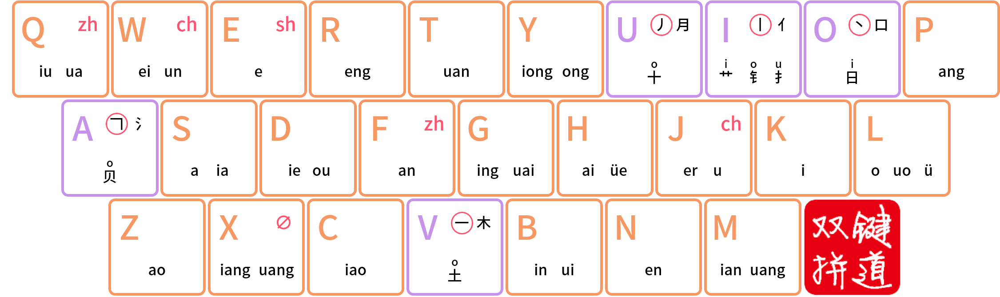

# 键道图谱


强烈建议初学者在浏览文档与前期学习时，先将键道图谱打印出来（或保持开启状态）并放在一旁，以供参考记忆


## 标准图谱

## 键位组成

键道作为一种音形码方案，顾名思义，其输入键位由音码和形码组成。键道的音码部分是双拼结构，比纯双拼稍难；形码部分是五笔画结构，比市面上绝大多数含形码的输入方案要简单得多。


键道图谱没有固定的记忆口诀，但稍作观察即可发现每个键位的韵母十分形似，且韵母中至少有一个能与该键位的平舌声母组成常用的汉字发音。以此为提示多加练习，一般数日便可完成记忆


## 乱序图谱

